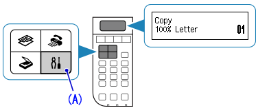
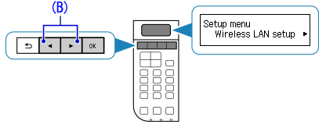
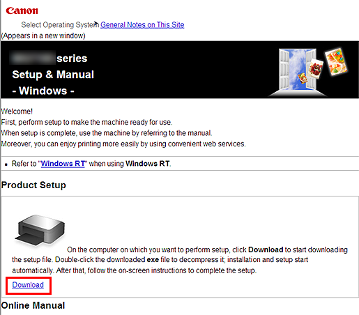
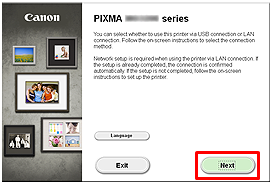
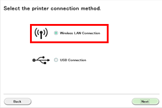
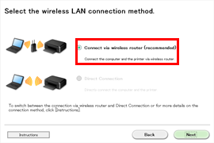

# CANON PIXMA WIRELESS SETUP

## How to connect the Canon printer to a wireless router via “cableless setup”

You can download and install drivers for your printer from the CANON printer driver official website and follow the steps given below:

1. Turn On Your Printer
2. Press the Setup  button (A) on the printer.
3. Use the Left or Right Arrow button (B) to select Wireless LAN setup .
4. []
5. Press the OK button.
6. Select other Setup
7. Press the OK button
8. []
9. []
10. []
11. Select Cableless Setup.
12. Press the OK Button
13. Now, the printer is ready for wireless LAN connection in the “Cableless setup” method.
14. The connection between the printer and the wireless router is not yet complete. To complete the connection, a software install is necessary. Install the software.
15. Install the Software (Windows)
16. Run the Official Setup of Canon Driver
17. Start Product Setup
18. []
19. []
20. []
21.  Double-click the CanonSetup .exe file. The setup will start automatically. Follow the on-screen instructions to complete installation.
22.   Click Next
23.   Click Wireless LAN Connection 
24.    Click Connect via wireless router (recommended) .
25.    Click Next .
26.    Click [Cableless setup .

20. Click  Next 

21. When the Setup Completion dialogue box appears, click Complete .

22. Click Next .

23. Test printing will be performed to check the printer’s operation.

24. Load plain paper into the printer and click  Execute .

25. After test printing, click  Next .

26. To skip test printing, click  Next  instead of  Execute .

27. Click  Exit  to complete the installation.
28. []

##  What are the Steps to Install Canon Printer Software ?

Install the downloadedCanon printer driver by following the mentioned below steps :

1. Get started by turning on your Canon printer.
2. Connect the printer to your Windows or Mac computer. Turn the device on.
3. Open up your preferred browser and go to [CANON PIXMA WIRELESS SETUP](https://printernfax.com/canon-pixma-wirless-setup) and click the ‘enter’ key.
4. Enter your Canon printer model number on the search box and click the download button below the product name.
5. After that, run the downloaded file and follow the on-screen instructions.
6. The wizard will now ask you to choose your connection type. You can select USB or wifi mode.
7. Finally, you can complete the canon setup drivers and software installation.

##  How to Setup A Canon Wireless Printer On a Mac device?

1. After Installing Printer, click on the Apple symbol and then, click System Preferences.
2. Then Click on the Printers & Scanners icon.
3. Click the plus **“+”**  symbol to add the printer and click Add Printer option.
4. A new window will open. Click on the IP icon at the top and fill the necessary data.
5. After that, Add the printer to your PC and it has to appear in your printers list once configuration is done. 
6.  Then Print a test page to confirm the printer is functioning well.
7. If the printer is not listed, then Follow the steps once again and reconnect the printer.
